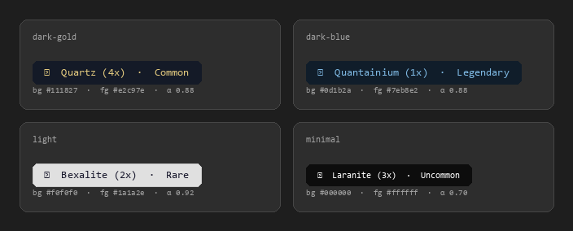

# SC Signature Reader

A transparent always-on-top overlay for Star Citizen.  
Automatically detects mining signature numbers in the HUD and displays  
the corresponding mineral name with multiplier.

**ToS-compliant** – no memory reading, no DLL injection, screen analysis only.

→ **[User Manual](USER_MANUAL.md)** — installation, setup wizard, control panel, hotkey, troubleshooting

---

## Concept

The overlay continuously analyses a configurable screen region.
Instead of reading a fixed pixel area (ROI), it actively searches for
orange pixel clusters in the image – exactly the colour SC uses to render
signature numbers. Each found cluster is passed through OCR and matched
against a lookup table of 155 known signature values.

---

## Data flow

```
[Star Citizen screen]
         |
         | screenshot every 500ms (mss)
         v
[Colour detection – OpenCV]
  HSV mask isolates orange pixels
  morphology closes gaps in glyphs
  contours → bounding boxes
         |
         | filtered by: area >= min_area
         |              aspect ratio 2.0–4.0
         v
[Preprocessing – Pillow]
  4× upscale
  R+G−B → isolate orange channel
  maximise contrast
  threshold → black / white
  invert → black text on white
         |
         v
[OCR – Tesseract]
  psm 7 (single text line)
  whitelist: digits 0–9 only
         |
         | raw text e.g. "16,840"
         v
[Normalisation]
  strip thousands separators
  fix common OCR mix-ups:
    l/I/| → 1,  O/o → 0,  S → 5,  B → 8,  Z → 2,  G → 6
         |
         | normalised digit string e.g. "16840"
         v
[Lookup – three-stage]
  1. Exact match         "16840" == "16840"
  2. Substring match     "16840" in recognised text
  3. Fuzzy (Levenshtein) edit distance <= fuzzy_max_distance
         |
         | result e.g. "Quartz (4x) · Common"
         v
[Voting over 3 frames]
  majority vote prevents flickering
  caused by unstable OCR output
         |
         v
[tkinter overlay]
  transparent window, always on top
  shows result, hides itself when no match found
```
## Setup
Copy `config.example.json` to `config.json` and adjust the paths,
or run the setup wizard: `SCSigReader.exe --setup`
---

## Installation

### 1. Dependencies

**Tesseract OCR**  
Windows: https://github.com/UB-Mannheim/tesseract/wiki  
Linux:   `sudo apt install tesseract-ocr`  
macOS:   `brew install tesseract`

**Python packages**
```bash
pip install mss pillow pytesseract opencv-python numpy
```

### 2. Virtual environment (recommended)
```bash
python -m venv .venv
.venv\Scripts\activate        # Windows
source .venv/bin/activate     # Linux / macOS
pip install mss pillow pytesseract opencv-python numpy
```
### Themes



### 3. Run
```bash
python main.py           # normal start
python main.py --setup   # run setup wizard first
```

---

## Configuration – config.json

| Key | Description | Default |
|---|---|---|
| `scan_region` | Screen area to scan | full screen |
| `hsv_low` | Lower HSV bound for orange | `[5, 80, 80]` |
| `hsv_high` | Upper HSV bound for orange | `[35, 255, 255]` |
| `min_area` | Minimum region area (px²) | `120` |
| `aspect_min` | Minimum width/height ratio | `2.0` |
| `aspect_max` | Maximum width/height ratio | `6.0` |
| `region_padding` | Pixel padding around detected region | `8` |
| `max_regions` | Max orange regions to OCR per cycle (largest first) | `3` |
| `vote_frames` | Number of frames for majority vote | `3` |
| `interval_ms` | Scan frequency in milliseconds | `500` |
| `fuzzy_max_distance` | Max Levenshtein distance (0 = disabled) | `1` |
| `tesseract_cmd` | Path to Tesseract executable | `tesseract` |
| `theme` | UI colour theme | `vargo` |
| `hotkey` | Pause/resume shortcut | `scroll lock` |
| `log_level` | Log verbosity: `DEBUG`, `INFO`, `WARNING`, `ERROR` | `INFO` |
| `overlay_x/y` | Overlay window position | `30/30` |
| `alpha` | Overlay transparency (0–1) | `0.88` |
| `audio_enabled` | Enable audio feedback | `true` |
| `audio_volume` | Master volume (0.0–1.0) | `0.5` |

### Recommended values for 2560×1440

```json
{
  "scan_region": { "top": 130, "left": 200, "width": 2160, "height": 900 },
  "hsv_low":  [5,  80,  80],
  "hsv_high": [35, 255, 255],
  "min_area": 120,
  "aspect_min": 2.0,
  "aspect_max": 4.0,
  "region_padding": 8,
  "vote_frames": 3,
  "interval_ms": 500,
  "fuzzy_max_distance": 1,
  "tesseract_cmd": "C:\\Program Files\\Tesseract-OCR\\tesseract.exe",
  "overlay_x": 30,
  "overlay_y": 30,
  "alpha": 0.88,
  "bg_color": "#111827",
  "fg_color": "#e2c97e",
  "font_family": "Consolas",
  "font_size": 13,
  "wrap_width": 400
}
```

### scan_region reference by resolution

| Resolution | top | left | width | height |
|---|---|---|---|---|
| 1920×1080 | 100 | 150 | 1620 | 680 |
| 2560×1440 | 130 | 200 | 2160 | 900 |
| 3440×1440 | 130 | 200 | 3040 | 900 |

> **Note:** The region covers the full game viewport (space view, above the cockpit dashboard).
> Rock labels float anywhere on screen depending on camera angle, so a full-width region is required.
> The orange "UNKNOWN" label (pre-scan state) is automatically ignored — it contains no digits.

---

## Lookup table – lookup.json

Contains 163 entries for 26 minerals × 6 multipliers + Salvage.  
Key = signature value as string, value = display text.

```json
{
  "16840": "Quartz (4x)  ·  Common",
  "17140": "Aluminum (4x)  ·  Common",
  "9510":  "Quantainium (3x)  ·  Legendary"
}
```

Collisions (same signature value, different minerals) are joined with ` / `:  
`"Aslarite (5x) · Uncommon  /  Savrilium (6x) · Legendary"`

---

## Helper scripts

| Script | Purpose |
|---|---|
| `calibrate_hsv.py` | Click on a signature pixel in a screenshot (or live capture) to get exact HSV values and suggested `hsv_low` / `hsv_high` config |
| `find_roi.py` | Shows live mouse coordinates — helps locate the scan region |
| `test_ocr.py` | Saves `1_original.png` + `2_preprocessed.png` — shows what Tesseract actually sees |
| `debug_script.py` | Analyses saved screenshots for detected orange regions |
| `generate_theme_preview.py` | Renders `theme_preview.png` from `themes.py` |

---

## File structure

```
sc_signature_reader/
├── main.py                     ← entry point, threads, hotkey
├── overlay.py                  ← OCR pipeline, lookup logic, scan loop
├── app_state.py                ← shared thread-safe state
├── control_panel.py            ← main UI window (Vargo Dynamics branded)
├── overlay_window.py           ← transparent always-on-top result window
├── display_window.py           ← optional cockpit display (VD-SFR1)
├── setup_wizard.py             ← first-run configuration wizard
├── tray_icon.py                ← system tray integration
├── audio_manager.py            ← WAV audio feedback
├── logger_setup.py             ← structured logging (RotatingFileHandler)
├── themes.py                   ← 5 built-in colour themes
├── lookup.json                 ← 163 signature values
├── config.example.json         ← config template (copy to config.json)
├── requirements.txt            ← Python runtime dependencies
├── SCSigReader.iss             ← Inno Setup installer script
├── test_core.py                ← unit tests
├── test_setup_wizard.py        ← wizard acceptance tests
├── test_integration.py         ← integration tests
├── test_ui_acceptance.py       ← UI acceptance tests
├── test_ocr.py                 ← OCR debugging helper
├── calibrate_hsv.py            ← click-to-calibrate HSV range helper
├── find_roi.py                 ← live mouse position helper for scan region
├── debug_script.py             ← screenshot region analysis
├── generate_theme_preview.py   ← renders theme_preview.png
├── sounds/                     ← WAV files for audio feedback
├── .github/workflows/
│   ├── ci.yml                  ← run tests on push/PR
│   └── release.yml             ← build installer on version tag
├── LICENSE
├── DISCLAIMER.md
└── README.md
```

---

## Disclaimer

This is a fan-made community tool and is not affiliated with or endorsed by Cloud Imperium Games.
It is designed to be ToS-compliant (screen capture only — no memory reading, no DLL injection).
Use at your own risk.

See [DISCLAIMER.md](DISCLAIMER.md) for the full disclaimer.

---

## Debug logging

Set `log_level` to `"DEBUG"` in `config.json` to enable verbose output:

```json
"log_level": "DEBUG"
```

**What DEBUG mode adds:**

- Per-cycle timing breakdown: `grab / find / ocr / lookup` phases in ms
- A `WARNING` when total cycle time exceeds 1000 ms, naming the slowest phase
- A **PERFORMANCE** section in the Control Panel showing average and last cycle time (updated every 5 s)
- Raw OCR output and lookup results for every detected region

**Log file location:**

```
%APPDATA%\VargoDynamics\SCSigReader\logs\scsigread.log
```

The **LOG** button in the Control Panel opens this folder directly.

> Tip: switch back to `"INFO"` for normal use — DEBUG generates one log line per scan cycle and will fill the log file quickly.

---

## Troubleshooting

**Overlay does not appear**  
→ Enable `"log_level": "DEBUG"` and check the log file for OCR output  
→ Run `test_ocr.py` and inspect `2_preprocessed.png` to see what Tesseract receives  

**Wrong matches / flickering**  
→ Increase `vote_frames` (e.g. `5`)  
→ Tighten `scan_region` around the signature area  
→ Use stricter `min_area` and `aspect_min/max` values  

**OCR detects nothing**  
→ Enable DEBUG logging and check if regions are found (`regions=X/Y` in timing lines)  
→ If `regions=0/0` every cycle: run `calibrate_hsv.py` to get the correct HSV values for your screen  
→ Run `test_ocr.py` to inspect the preprocessed image  

**Slow scan cycles (> 1000 ms)**  
→ Enable DEBUG logging — the PERFORMANCE panel shows avg/last cycle time  
→ Reduce `max_regions` (e.g. `2`) to limit Tesseract calls per cycle  
→ Check `regions=X/Y`: if X is always at the cap, many false orange regions exist — tighten `scan_region`  

**Different resolution or FOV**  
→ Adjust `scan_region` (see reference table above)  
→ Colour detection itself is resolution- and FOV-independent
