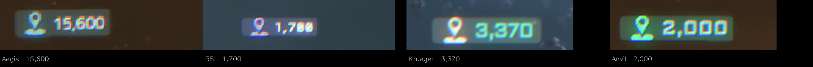
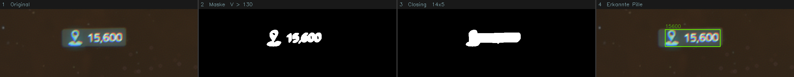

# SC Signature Reader — Erkennungsstrategie v2

## Übersicht

Die neue Strategie ersetzt die hersteller-spezifische HSV-Farberkennung durch einen
einzigen, hersteller-unabhängigen Erkennungsweg, der auf der Struktur des
Signatur-Display-Elements basiert.

---

## 1. Das universelle Signatur-Display

Alle getesteten Schiffe verwenden **exakt dasselbe UI-Element** für die Signaturanzeige:
eine dunkle, abgerundete Pille mit einem Location-Pin-Icon links und der Signaturzahl rechts.



| Hersteller | HUD-Farbe | Signatur (Beispiel) |
|-----------|-----------|---------------------|
| Aegis     | Cyan      | 15.600              |
| RSI       | Lila      | 1.700               |
| Krueger   | Grün      | 3.370               |
| Anvil     | Orange    | 2.000               |

Das Icon ist hersteller-spezifisch eingefärbt, aber **Form und Position** des
Elements sind identisch. Die Signaturzahl erscheint immer in der gleichen weißlichen
Farbe rechts neben dem Icon.

---

## 2. Warum reine Weiß-Erkennung nicht funktioniert

Der erste Ansatz war, nur die weißen Pixel (niedriger S-Wert im HSV-Farbraum) zu
detektieren. Das scheitert aus folgendem Grund:

**Das HUD ist halbtransparent.** Der Weltraum-Hintergrund scheint durch. In einem
farbigen Nebel (z. B. türkis/blau bei RSI) wird der vermeintlich weiße Text zur
**Mischfarbe** aus Weiß und Nebelfarbe. Hinzu kommt chromatische Aberration durch
die Spielengine, die rote und blaue Fringes an den Ziffernkanten erzeugt.

| Hintergrund | Erwartete Sättigung (S) | Gemessene Sättigung (S) |
|------------|-------------------------|-------------------------|
| Dunkler Weltraum (ideal) | ~0 | ~65–95 |
| Türkiser Nebel (RSI) | ~0 | ~83–117 |
| Orangener Asteroid (Anvil) | ~0 | ~101–141 |

Mit einem Schwellwert von `S < 40` (reines Weiß) würden nur **12–32 Pixel** pro
Signatur-Anzeige erkannt — zu wenig für zuverlässige Clusterbildung.

---

## 3. Die neue Strategie: Helligkeits-basierte Pille

Statt nach Farbe oder Weiß zu suchen, wird die **kombinierte Helligkeit** des gesamten
Pille-Inhalts (Icon + Zahl) detektiert.

### Pipeline



#### Schritt 1 — V-Kanal Schwellwert (`V > 130`)
Alle hellen Pixel des Bildes werden isoliert. Das erfasst Icon und Ziffern gemeinsam,
unabhängig von ihrer Farbe oder Sättigung. Der dunkle Hintergrund (Weltraum, Nebel)
fällt heraus.

#### Schritt 2 — Morphologisches Closing (`14 × 5 Pixel`)
Der horizontale Kernel verbindet die Lücken zwischen den einzelnen Ziffern und dem
Icon zu einem zusammenhängenden weißen Blob — der **Kandidaten-Region**.

#### Schritt 3 — Bounding-Box-Filter
Jeder Blob wird nach seiner Bounding-Box (nicht Konturfläche!) gefiltert:

| Parameter | Wert | Begründung |
|-----------|------|------------|
| `pill_area_min` | 500 px² | Kleiner Rauschen ausfiltern |
| `pill_area_max` | 1.600 px² | Cockpit-Panels haben `w×h > 1.700` |
| `pill_aspect_min` | 2,0 | Breiter als hoch (Zahlenpille) |
| `pill_aspect_max` | 6,0 | Alle Sig-Pillen liegen bei 3,2–3,7; Wert ≥ 7 = False Positive |

> **Warum Bounding-Box statt Konturfläche?**
> Cockpit-Panels haben eine niedrige fill-Ratio (~0,4). Ein Panel mit
> Bounding-Box 4.687 px² hat eine Konturfläche von ~1.875 px² und würde einen
> alten `contourArea`-Filter von 2.000 knapp passieren. Die Bounding-Box (4.687)
> schließt ihn zuverlässig aus.

#### Schritt 4 — Target-Area-Ranking
Die verbleibenden Kandidaten werden nach ihrer Nähe zur **Ziel-Fläche von 1.200 px²**
sortiert. Alle vier getesteten Hersteller haben Signatur-Pillen im Bereich 1.000–1.400 px².
Der wahrscheinlichste Kandidat wird damit zuerst verarbeitet.

#### Schritt 5 — OCR
Für jeden Kandidaten:
1. Bereich um den Cluster croppen (+ kleines Padding)
2. Auf Zielhöhe 60 px skalieren
3. Grauwert → Schwellwert 140 → Invertieren (schwarzer Text auf weißem Hintergrund)
4. Tesseract PSM 7, nur Ziffern `0–9`
5. Normalisierung + Lookup (Exact → Substring → Fuzzy)

Die Schleife stoppt beim **ersten validen Lookup-Treffer**.

---

## 4. Umgang mit dem Location-Pin-Icon

Das Icon steht links im Cluster. Da es hersteller-spezifisch gefärbt ist (cyan, lila,
grün, orange), können seine Pixel chromatische Aberration erzeugen, die von Tesseract
als Ziffer `2` fehlgelesen wird. Beispiele:

| Hersteller | OCR-Raw | Lookup | Ergebnis |
|-----------|---------|--------|---------|
| Aegis  | `15600`  | Exact  | ✓ korrekt |
| RSI    | `1700`   | Fuzzy Δ=1 | ✓ korrekt |
| Krueger | `23370` | `3370 ⊂ 23370` (Substring) | ✓ korrekt |
| Anvil  | `22000`  | `2000 ⊂ 22000` (Substring) | ✓ korrekt |

Die Substring-Logik in `lookup_text()` fängt diese Fälle zuverlässig ab, da die
Lookup-Tabelle nur bekannte 4–5-stellige Mineralwerte enthält.

---

## 5. Konfiguration

Alle Parameter sind in `config.json` überschreibbar:

```json
{
  "pill_v_threshold":  130,
  "pill_close_w":       14,
  "pill_close_h":        5,
  "pill_aspect_min":   2.0,
  "pill_aspect_max":   6.0,
  "pill_area_min":     500,
  "pill_area_max":    1600,
  "pill_area_target": 1200,
  "pill_text_extend":  100,
  "text_strip_hpad":     6,
  "white_threshold":   140,
  "target_ocr_height":  60,
  "max_pills":           6
}
```

---

## 6. Bekannte Einschränkungen

| Problem | Auswirkung | Status |
|---------|------------|--------|
| Fuzzy-Match auf False Positives (z. B. `9740` → falsches Mineral) | Frühzeitiger falscher Treffer möglich | Behoben: `pill_aspect_max` 8→6 filtert Hochseitenverhältnis-FPs; Strict-Lookup im Hot-Path + Fuzzy als Post-Loop-Fallback |
| Icon erzeugt Pseudo-`2` (Krueger, Anvil) | Cosmetic; Substring-Lookup kompensiert | Akzeptiert |
| Ungetestete Hersteller (Argo, Drake, …) | Unbekannte Pille-Größe / HUD-Transparenz | Detail-Fixture erforderlich |
| Sehr helle Hintergründe (Planet-Oberfläche, Sonne) | V-Schwellwert könnte zu viele Pixel aktivieren | Noch nicht getestet |
